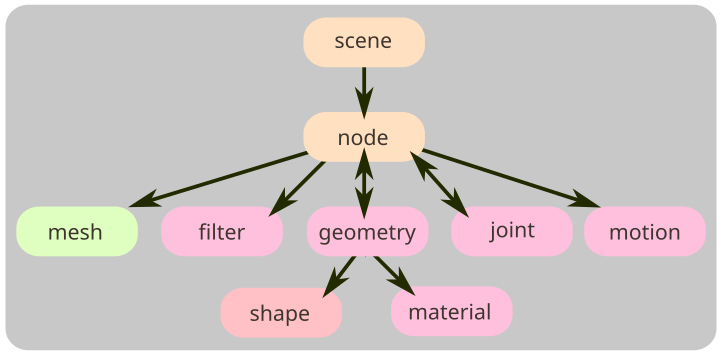

# KHR_physics_rigid_bodies

## Contributors <!-- omit in toc -->

* Rory Mullane, Microsoft, <mailto:romul@microsoft.com>
* Eoin McLoughlin, Microsoft, <mailto:eomcl@microsoft.com>
* George Tian, Microsoft, <mailto:geotian@microsoft.com>
* Aaron Franke, Godot Engine, <mailto:arnfranke@yahoo.com>

## Status <!-- omit in toc -->

Draft

## Dependencies <!-- omit in toc -->

Written against glTF 2.0 spec.

This specification depends on `KHR_collision_shapes` to describe geometries used for collision detection.

This specification will be updated to add support for the forthcoming glTF Interactivity and Animation Pointer (glTF Object Model) extensions. These are expected to be additional, non-breaking changes.

## Table of Contents <!-- omit in toc -->

- [Overview](#overview)
- [Units](#units)
- [glTF Schema Updates](#gltf-schema-updates)
  - [Motions](#motions)
  - [Colliders](#colliders)
  - [Physics Materials](#physics-materials)
  - [Collision Filtering](#collision-filtering)
  - [Triggers](#triggers)
  - [Joints](#joints)
- [JSON Schema](#json-schema)
- [Known Implementations](#known-implementations)
- [Validator](#validator)

## Overview

This extension defines a set of properties which may be added to glTF nodes, making them suitable for rigid body simulation. Such a simulation may update node transforms, effectively animating node transforms procedurally in a physically plausible manner.

Properties added by this extension include:

- Collision geometry, used to determine when nodes are physically overlapping.
  - Collision filters, which allow for control over which pairs of nodes should collide.
- Joints, which describe physical connections between nodes.
- Mass and velocity, describing the movement of nodes.

This diagram augments the overview diagram in the [main glTF repository](https://github.com/KhronosGroup/glTF).

Note, amongst rigid body engines which exist today, there are a wide variety of approximations and solving strategies in use which result in differing behavior. As such, the same asset is very likely to behave differently in different simulation engines or with different settings applied to one simulation engine. An implementation should make a best effort to implement this specification within those limitations; this requires some discretion on the part of the implementer - for example, a video game is very likely willing to accept inaccuracies which would be unacceptable in a robotic training application.

### Units

Units used in this specification are the same as those in the [glTF specification](https://registry.khronos.org/glTF/specs/2.0/glTF-2.0.html#coordinate-system-and-units); some additional units are used by this extension:

| Property | Units|
|-|-|
|`motion.mass`|Kilograms (kg)|
|`motion.inertiaDiagonal`|Kilogram meter squared (kg·m2)|
|`motion.linearVelocity`|Meter per second (m·s-1)|
|`motion.angularVelocity`|Radian per second (rad·s-1)|
|`joint_limit.stiffness`,   `joint_drive.stiffness`|Newton per meter (N·m-1) for linear limits   Newton meter per radian (N·m·rad-1) for angular limits|
|`joint_limit.damping`,   `joint_drive.damping`|Newton second per meter (N·s·m-1) for linear limits  Newton second meter per radian (N·s·m·rad-1) for angular limits|

## glTF Schema Updates

The `KHR_physics_rigid_bodies` extension may be added to any `node` to define one or more of the following properties:

| |Type|Description|
|-|-|-|
|**motion**|`object`|Allows the physics engine to move this node, describing parameters for that motion.|
|**collider**|`object`|Describes the physical representation of a node's shape.|
|**trigger**|`object`|Describes a volume which can detect collisions, but not react to them.|
|**joint**|`object`|Constrains the motion of this node relative to another.|

### Motions

If a `node` has `motion` properties, that node should be represented by a rigid body in the simulation engine and the node's local transform should be updated by the physics engine after every simulation step.

As the simulation engine updates the local transform of a node, all descendant nodes should move with that node - i.e. the physics engine should treat them as part of a single rigid body. However, if a descendant node has its own `motion` properties, that node must be treated as an independent rigid body during simulation - there is no implicit requirement that it follows its 'parent' rigid body.

If a rigid body node's transform is animated by animations in the file, those animations should take priority over the physics simulation. Rigid bodies should follow the transforms provided by the animations. A simulation engine has several options for how this can be achieved - for example, the rigid body may be instantaneously teleported, without traversing the intermediate space. Alternatively, a simulation engine may set velocities or joint motors such that the node reaches the target transform within the simulation step.

Rigid body motions have the following properties:

| |Type|Description|
|-|-|-|
|**isKinematic**|`boolean`|Treat the rigid body as having infinite mass. Its velocity will be constant during simulation.|
|**mass**|`number`|The mass of the rigid body. Larger values imply the rigid body is harder to move.|
|**inertiaOrientation**|`number[4]`|The rotation quaternion rotating from inertia major axis space to body space|
|**inertiaDiagonal**|`number[3]`|The principal moments of inertia.  Larger values imply the rigid body is harder to rotate.|
|**centerOfMass**|`number[3]`|Center of mass of the rigid body in local space.|
|**linearVelocity**|`number[3]`|Initial linear velocity of the rigid body in local space.|
|**angularVelocity**|`number[3]`|Initial angular velocity of the rigid body in local space.|

If not provided, the mass and inertia properties should be calculated by the simulation engine. These values are typically derived from the collision geometry used by the rigid body.

### Colliders

Pairs of triangulated meshes are typically unsuitable for collision detection. As such, this extension adds an additional `collider` property to a node. This property is used to describe the geometry and collision response of this node.

The `collider` property supplies three fields; the `shape` property indexes into the set of top level collision shapes (provided by `KHR_collision_shapes`) and describes the collision volume used by that node. The `physicsMaterial` indexes into the top level set of physics materials (see the "[Physics Materials](#physics-materials)" section of this document.) Finally, the `collisionFilter` indexes into the top level set of collision filters (see the "Collision Filtering" section of this document).

| |Type|Description|
|-|-|-|
|**shape**|`integer`|The index of a top level `KHR_collision_shapes.shape`, which provides the geometry of the collider.|
|**physicsMaterial**|`integer`|Indexes into the top level `physicsMaterials` and describes the physics material which the collider is made from.|
|**collisionFilter**|`integer`|Indexes into the top level `collisionFilters` and describes a filter which determines if this collider should perform collision detection against another collider.|

If the node is part of a rigid body (i.e. itself or an ascendant has `motion` properties) then the collider belongs to that rigid body and must move with it during simulation. Otherwise the collider exists as a static object in the physics simulation which can be collided with but must not be moved as a result of solving collisions or joints. A rigid body may have multiple descendent `collider` nodes.

Implementations of this extension should ensure that collider transforms are always kept in sync with node transforms - for example animated node transforms should be applied to the physics engine (even for static colliders).

Note, `convex` and `trimesh` colliders can impose a large computational cost when converting to native types if the source mesh contains many vertices. In addition, real-time engines generally recommend against allowing collisions between two `trimesh` objects. For best performance and behavior, consult the manual for the physics simulation engine you are using.

### Physics Materials

When a pair of nodes collide with each other, additional properties are needed to determine the collision response. This response is partly controlled by the physics materials of each collider.

The top level array of `physicsMaterials` is provided by adding the `KHR_physics_rigid_bodies` extension to the root `glTF` object. If a collider has no physics material assigned, the simulation engine may choose any appropriate default values.

Physics materials offer the following properties:

| |Type|Description|
|-|-|-|
|**staticFriction**|`number`|The friction used when an object is laying still on a surface. Typical range from 0 to 1.|
|**dynamicFriction**|`number`|The friction used when already moving. Typical range from 0 to 1.|
|**restitution**|`number`|Coefficient of restitution. Typical range from 0 to 1.|
|**frictionCombine**|`string`|How to combine two friction values. "average", "minimum", "maximum", or "multiply".|
|**restitutionCombine**|`string`|How to combine two restitution values. "average", "minimum", "maximum", or "multiply".|

For handling friction parameters, a physics simulation should use a Coulomb friction model. The friction coefficient to use is be determined by the relative velocity of the surfaces perpendicular to the contact normal. When this velocity is sufficiently close to zero, the value of `staticFriction` should be used, otherwise, `dynamicFriction` should be used.

When a pair of physics materials interact during a simulation step, the applied friction and restitution values are based on their "combine" policies:

- If either uses "average" : The two values should be averaged.
- Else if either uses "minimum" : The smallest of the two values should be used.
- Else if either uses "maximum" : The largest of the two values should be used.
- Else if either uses "multiply" : The two values should be multiplied with each other.

### Collision Filtering

With exception of colliders which are descendants of the same rigid body, every `collider` in a scene should generate a collision response with every other `collider` when they are sufficiently close together to be considered in contact.

In some scenarios, this is undesirable; a collision filter allows control over which pairs of `collider` objects may interact. An array of `collisionFilters` are provided by the `KHR_physics_rigid_bodies` extension on the root `glTF` object. Each filter contains a subset of the fields:

| |Type|Description|
|-|-|-|
|**collisionSystems**|`[string]`|An array of arbitrary strings indicating the "system" a node is a member of.|
|**notCollideWithSystems**|`[string]`|An array of strings representing the systems which this node will _not_ collide with|
|**collideWithSystems**|`[string]`|An array of strings representing the systems which this node can collide with|

Both `collideWithSystems` and `notCollideWithSystems` are provided so that users can override the default collision behavior with minimal configuration -- only one of these should be specified per object. Note, given knowledge of all the systems in a scene and one of the values `notCollideWithSystems`/`collideWithSystems` the unspecified field can be calculated: `collideWithSystems = notCollideWithSystems'`

`notCollideWithSystems` is useful for an object which should collide with everything except those listed in `notCollideWithSystems` (i.e., used to opt-out of collisions) while `collideWithSystems` is the inverse -- the collider should not collide with any other collider except those listed in `collideWithSystems`

A node `A` will collide with node `B` if `A.collisionSystem ⊆ B.collideWithSystems && A.collisionSystem ⊄ B.notCollideWithSystems`

This can generate asymmetric states - `A` might determine that it _does_ collide with `B`, but `B` may determine that it _does not_ collide with `A`. As the default behavior is that collision should be enabled, both `doesCollide(A, B)` and `doesCollide(B, A)` tests should be performed and collision should not occur if either returns false.

### Triggers

A useful construct in a physics engine is a collision volume which does not generate impulses when overlapping with other volumes but do generate events which execute application-specific logic. These objects are typically called "triggers", "sensors", "phantoms", or "overlap volumes" in physics simulation engines. Triggers allow specifying such volumes either as a single shape or combination of shapes.

A trigger is added to a node by specifying the `trigger` property.

A `trigger` may specify a `shape` property which references a geometric shape defined by the `KHR_collision_shapes` extension as well as an optional `collisionFilter` parameter, with the same semantics as a `collider`.

Alternatively, a `trigger` may have a `nodes` property, which is an array of glTF nodes which make up a compound trigger on this glTF node. The nodes in this array must be descendent nodes which must have `trigger` properties.

| |Type|Description|
| - | - | -|
|**shape**|`integer`| The index of a top level `KHR_collision_shapes.shape`, which provides the geometry of the trigger.|
|**nodes**|`[integer]`|For compound triggers, the set of descendant glTF nodes with a trigger property that make up this compound trigger.|
|**collisionFilter**|`integer`|Indexes into the top level `collisionFilters` and describes a filter which determines if this collider should perform collision detection against another collider.|

Describing the precise mechanism by which overlap events are generated and what occurs as a result is beyond the scope of this specification; simulation software will typically output overlap begin/end events as an output from the simulation step, which is hooked into application-specific business logic.

### Joints

If a `node` has `joint` properties, that implies it should be constrained to another object during physics simulation.
Joints require a `connectedNode` property, defining the other end of the joint, in addition to a `joint` property, which indexes into the top level array of `physicsJoints` and determines how the range of motion is restricted.
In order for the joint to have any effect on the simulation, at least one of the connected nodes or its ancestors should have `motion` properties (otherwise the nodes cannot be moved by the physics engine).

The transform of the joint node from the first parent `motion` (or the simulation's fixed reference frame, if no such `motion` exists) defines the constraint space in that body. Similarly, the transform from the `connectedNode` to the first ancestor `motion` (or fixed frame) defines the constraint space within that body. If a joint were to eliminate all degrees of freedom, the physics simulation should attempt to move the `motion` nodes such that the transforms of the constrained child nodes (i.e. the `joint` node and the node at index `connectedNode`) become aligned with each other in world space.

The top level array of `physicsJoints` objects is provided by adding the `KHR_physics_rigid_bodies` extension to any root `glTF` object and contains an array of joint descriptions. Joints must contain one of more `joint_limit` objects and may contain zero or more `joint_drive` objects. Each of the limit objects remove some of the relative movement permitted between the two connected nodes, while the drive objects apply forces to achieve a relative transform or velocity between the joint node and the connected node.

Each limit object contains the following properties:

| |Type|Description|
|-|-|-|
|**linearAxes**|`integer[1..3]`|The linear axes to constrain (0=X, 1=Y, 2=Z).|
|**angularAxes**|`integer[1..3]`|The angular axes to constrain (0=X, 1=Y, 2=Z).|
|**min**|`number`|The minimum allowed relative distance/angle.|
|**max**|`number`|The maximum allowed relative distance/angle.|
|**stiffness**|`number`|Optional softness of the limits when beyond the limits.|
|**damping**|`number`|Optional spring damping applied when beyond the limits.|

Each constraint must provide an array of axes which are restricted.
These axes refer to the columns of the basis defined by the transform of the connected nodes and as such, should be in the range 0 to 2.
The number of axes provided determines whether is should be a 1, 2 or 3 dimensional constraint as follows:
* For linear constraints, a 1D constraint will keep that axis within the `min` and `max` distance from the infinite plane defined by the other two axes.
A 2D constraint will keep the node translations within a certain distance from an infinite line (i.e., within an infinite cylinder) and a 3D constraint will keep the nodes within a certain distance from a point (i.e. within a sphere).
* For angular constraints, a 1D constraint restricts angular movement about one axis, as in a universal joint.
A 2D constraint restricts angular movement about two - keeping the pivots within a cone.

Each constraint contains a `min` and `max` parameter, describing the range of allowed difference between the two node transforms - within this range, the constraint is considered non-violating and no corrective forces are applied.
These values represent a _distance_ for linear constraints, or an _angle_ in radians for angular constraints.

Additionally, each constraint has an optional `stiffness` and `damping` which specify the proportion of the recovery applied to the constraint.
By default, an infinite spring constant is assumed, implying hard limits. Specifying a finite stiffness will cause the constraint to become soft at the limits.

This approach of building joints from a set of individual constraints is flexible enough to allow for many types of bilateral joints.
For example, to define a hinged door can be constructed by locating connected nodes at the point where the physical hinge would be on each body, adding a 3D linear constraint with zero maximum distance, a 1D angular constraint describing the swing of the door around it's vertical axis, and a 2D angular constraint with zero limits about the remaining two axes.

Note however that some types of constraint are currently not possible to describe.
For example, a pulley, which needs a third transform in order to calculate a distance, cannot be described. Similarly, this does not have a mechanism to link two axes by some factor, such as a screw, whose translation is affected by the amount of rotation about some axis.

Addition of drive objects to a joint allows the joint to apply additional forces to modify the relative transform between the joint object and the connected node. A `joint_drive` object models a forced, damped spring and contains the following properties:

| |Type|Description|
|-|-|-|
|**type**|`string`|Determines if the drive affects is a `linear` or `angular` drive|
|**mode**|`string`|Determines if the drive is operating in `force` or `acceleration` mode|
|**axis**|`integer[1..3]`|The index of the axis which this drive affects|
|**maxForce**|`number`|The maximum force that the drive can apply|
|**positionTarget**|`number`|The desired relative target between the pivot axes|
|**velocityTarget**|`number`|The desired relative velocity of the pivot axes|
|**stiffness**|`number`|The drive's stiffness, used to achieve the position target|
|**damping**|`number`|The damping factor applied to reach the velocity target|

Each `joint_drive` describes a force applied to one degree of freedom in constraint space, specified with a combination of the `type` and `axis` parameters and drives to either a target position, velocity, or both. The drive force is proportional to `stiffness * (positionTarget - currentPosition) + damping * (velocityTarget - currentVelocity)` where `currentPosition` and `currentVelocity` are the signed values of the position and velocity of the connected node in constraint space. To assist with tuning the drive parameters, a drive can be configured to be in an `acceleration` `mode` which scales the force by the effective mass of the driven degree of freedom. This mode is typically easier to tune to achieve the desired behaviour, particularly in scenarios where the masses of the connected nodes are not known in advance.

### JSON Schema

* **JSON schema**: [glTF.KHR_physics_rigid_bodies.schema.json](schema/glTF.KHR_physics_rigid_bodies.schema.json)

## Known Implementations

[Blender importer/exporter](https://github.com/eoineoineoin/glTF_Physics_Blender_Exporter)

[Babylon.js importer](https://github.com/eoineoineoin/glTF_Physics_Babylon)

[Godot importer](https://github.com/eoineoineoin/glTF_Physics_Godot_Importer)

## Validator

[glTF validator](https://github.com/eoineoineoin/glTF-Validator)
