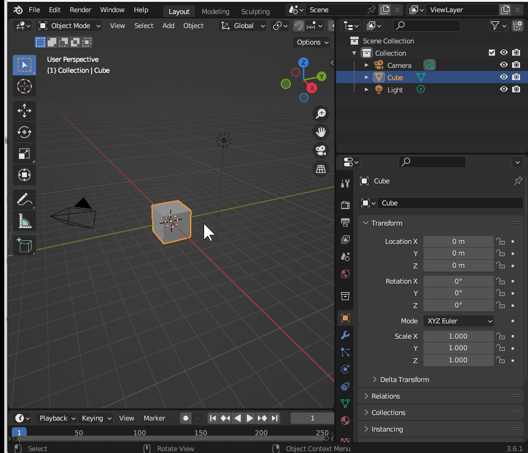
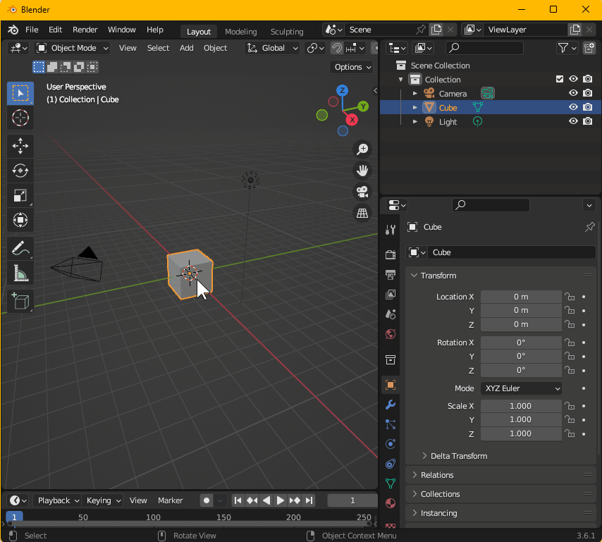
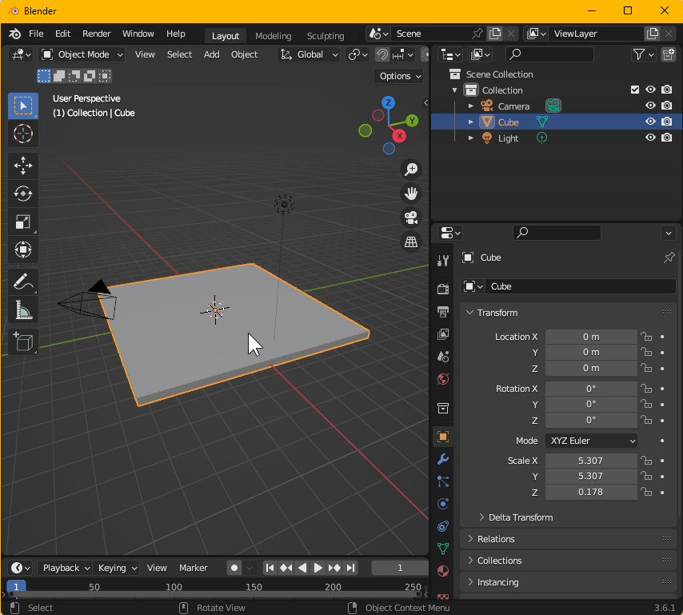
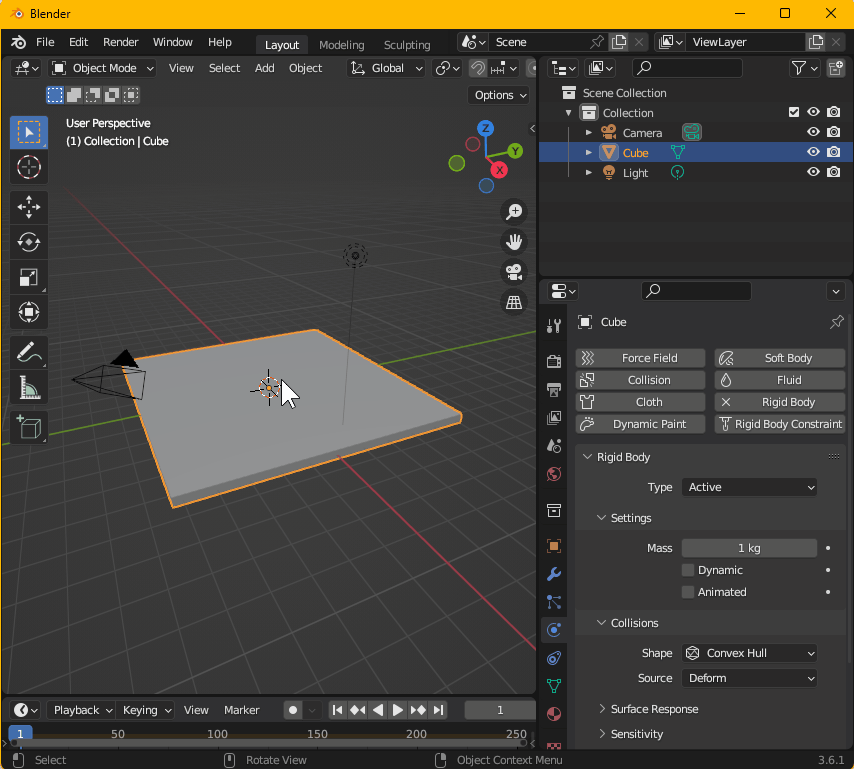
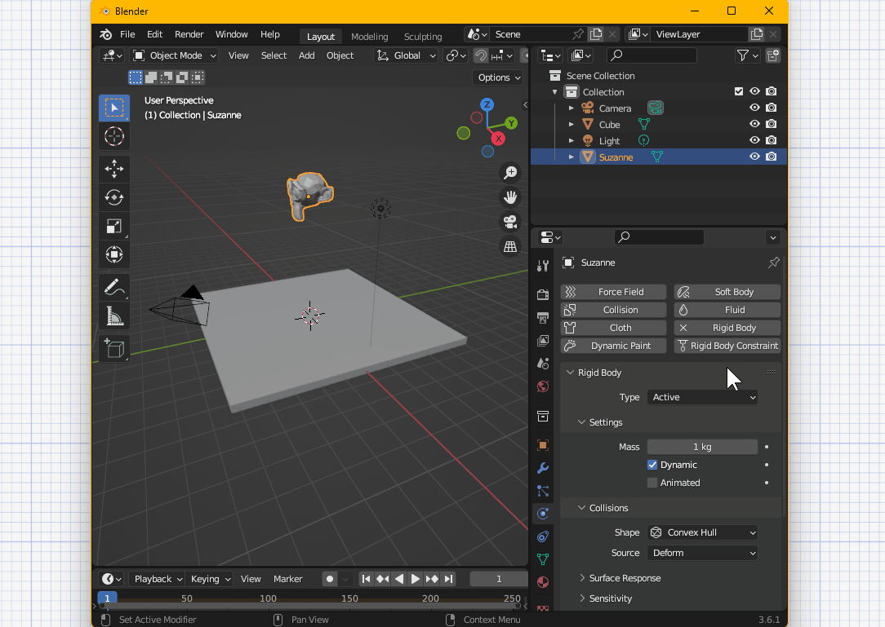
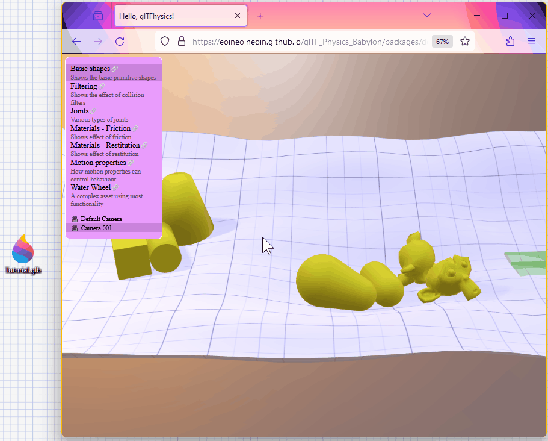

# Physics in 5 minutes

This tutorial aims to show you how to get started adding physics to your glTF files.

### Preparation

We'll use [Blender](https://www.blender.org) to make some models. Ensure you have Blender installed. Blender has a built-in glTF exporter, but it doesn't currently handle physics. We'll need to install an additional add-on to enable this.

If you haven't done so already, install the [KHR_rigid_bodies Blender plugin](https://github.com/eoineoineoin/glTF_Physics_Blender_Exporter) by downloading the latest zip from the [releases](https://github.com/eoineoineoin/glTF_Physics_Blender_Exporter/releases/) page. To install it:

1. Launch Blender.
2. Navigate to Edit → Preferences → Add-ons and click the "Install" button.
3. Select the zip file you downloaded.
4. Enable the KHR\_physics\_rigid\_bodies add-on.

### Creating the physics scene
Now, let's setup the scene. Select the default cube; this cube will become the floor. Scale it up in X and Y, and scale it down in Z, so it becomes a large, thin box:

Now, we'll add the physics properties. The add-on we installed makes use of Blender's built-in physics tools, which you might already be familiar with. In the outliner, with the "Cube" selected, open the "Physics" tab and click the "Rigid Body" button. This will allow the "Cube" to move under physics. However, since this object represents our ground, we really don't want it to move, so let's _untick_ the "Dynamic" box.

A scene which has no dynamic bodies is not going to run any interesting physics. So, let's add a monkey mesh to the scene using Add → Mesh → Monkey. Raise it into the air, so we'll be able to see it fall down. Then, finally, we'll add a "Rigid Body", this time, keeping the "Dynamic" box _ticked_.

### Exporting a physics-enabled glTF file
That's our scene setup! Now, we want to export our glTF. Open the "File" menu and navigate to "Export" → "glTF 2.0 (.glb/gltf)" - in the export window, ensure that "KHR\_physics\_rigid\_bodies" is ticked in the "Exporter Extensions" section. For this example, we'll also enable "Cameras" in the "Include" section, so the viewer can identify a good camera position.

### Previewing the file

Finally, we'll want to actually look at the asset. The Babylon.JS loader for this extension has a demo page we can use. Open up the [demo page](https://eoineoineoin.github.io/glTF_Physics_Babylon/packages/demo/dist/) in a browser and simply drop your exported file onto the window

You should now see the Monkey head fall down, simulated by physics. In this preview application, you can grab objects by hovering over them and holding space.
