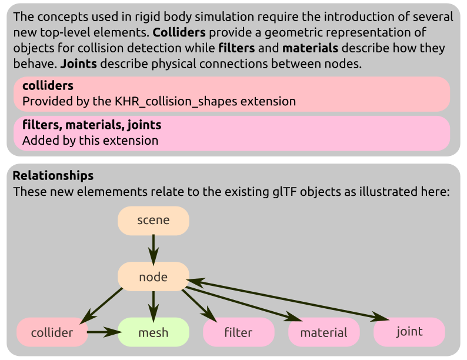

# KHR\_rigid\_bodies

## Contributors

* Rory Mullane, Microsoft, <mailto:romul@microsoft.com>
* Eoin McLoughlin, Microsoft, <mailto:eomcl@microsoft.com>
* George Tian, Microsoft, <mailto:geotian@microsoft.com>

## Status

Draft

## Dependencies

Written against glTF 2.0 spec.

## Overview

This extension adds the ability to specify physical properties to a glTF asset, suitable for a rigid body simulation. An implementation of this extension can use the properties described by this extension to animate node transforms by simulating them using a rigid body simulation engine. Objects within the asset can collide with each other and be constrained together to produce physically plausible interactions. For shorthand, this document will refer to a "simulation," "engine," or "physics engine" - this should be understood to mean "rigid body simulation software."

This diagram augments the overview diagram in the [main glTF repository](https://github.com/KhronosGroup/glTF).

Note, rigid body engines which exist today (in particular, those which operate in real-time contexts) make a large variety of approximations which have associated trade-offs, limitations, and artifacts. As such, the same asset is very likely to behave differently in different engines or with different settings applied to one engine. An implementation should make a best effort to implement this specification within those limitations; this requires some discretion on the part of the implementer - for example, a video game is very likely willing to accept inaccuracies which would be unacceptable in a robotic training application.

### Units

Units used in this specification are the same as those in the [glTF specification](https://registry.khronos.org/glTF/specs/2.0/glTF-2.0.html#coordinate-system-and-units); some additional units are used by this extension:

| Property | Units|
|-|-|
|`motion.mass`|Kilograms (kg)|
|`motion.inertiaDiagonal`|Kilogram meter squared (kg·m2)|
|`motion.linearVelocity`|Meters per second (m·s-1)|
|`motion.angularVelocity`|Radians per second (rad·s-1)|
|`joint.constraint.springConstant`|Newton per meter (N·m-1)|

## glTF Schema Updates

The `KHR_rigid_bodies` extension can be added to any `node` to define one or more of the following properties:

| |Type|Description|
|-|-|-|
|**motion**|`object`|Allows the physics engine to move this node, describing parameters for that motion.|
|**collider**|`object`|Describes the physical representation of a node's shape.|
|**trigger**|`object`|Describes a volume which can detect collisions, but not react to them.|
|**joint**|`object`|Constrains the motion of this node relative to another.|

### Rigid Bodies

If a `node` has `motion` properties, that implies that its transform should driven by the physics engine.
The physics engine should update the node's local transform after every simulation step.

All descendant nodes should move with that node - i.e. the physics engine should treat them as part of a single rigid body.
However if a descendant node has its own `motion` properties, that should be treated as an independent rigid body during simulation - there is no implicit requirement that it follows its 'parent' rigid body.

If a rigid body node's transform is animated by animations in the file, those animations should take priority over the physics simulation. Rigid bodies should follow the transforms provided by the animations.

Rigid body motions have the following properties:

| |Type|Description|
|-|-|-|
|**isKinematic**|`boolean`|Treat the rigid body as having infinite mass. Its velocity will be constant during simulation.|
|**mass**|`number`|The mass of the rigid body. Larger values imply the rigid body is harder to move.|
|**inertiaOrientation**|`number[4]`|The rotation quaternion rotating from inertia major axis space to body space|
|**inertiaDiagonal**|`number[3]`|The principal moments of inertia.  Larger values imply the rigid body is harder to rotate.|
|**centerOfMass**|`number[3]`|Center of mass of the rigid body in local space.|
|**linearVelocity**|`number[3]`|Initial linear velocity of the rigid body in local space.|
|**angularVelocity**|`number[3]`|Initial angular velocity of the rigid body in local space.|

### Colliders

To specify the geometry used to perform collision detection, we use the KHR\_collision\_shapes extension. To add collision geometry and enable a node to generate impulses from collision detection, a node's `collider` property is used. This property supplies three fields; the `collider` property indexes into the set of top level collision shapes and describes the collision volume used by that node, while the `physicsMaterial` indexes into the top level set of physics materials (see the "Collision Response" section of this document) and the `collisionFilter` indexes into the top level set of collision filters (see the "Collision Filtering" section of this document).

| |Type|Description|
|-|-|-|
|**shape**|`integer`|The index of a top level `Shape`, which provides the geometry of the shape.|
|**physicsMaterial**|`integer`|Indexes into the top level `physicsMaterials` and describes the collision response of the material which the collider is made from.|
|**collisionFilter**|`integer`|Indexes into the top level `collisionFilters` and describes a filter which determines if this collider should perform collision detection against another collider.|

If the node is part of a rigid body (i.e. itself or an ascendant has `motion` properties) then the collider belongs to that rigid body and should move with it during simulation. Otherwise the collider exists as a static object in the physics simulation which can be collided with but can not be moved.

Implementations of this extension should ensure that collider transforms are always kept in sync with node transforms - for example animated node transforms should be applied to the physics engine (even for static colliders).

Note that, depending on the simulation engine in use, `convex` and `trimesh` colliders may impose a large computational cost when converting to native types if the source mesh contains many vertices. In addition, real-time engines generally prefer to avoid collisions between two `trimesh` objects. For best performance and behavior, consult the manual for the physics simulation engine you are using.

**Collision Response**

You can control how objects should respond during collisions by tweaking their friction and restitution values as well as by controlling which pairs of colliders should interact. This is done by providing the following collider properties:

The top level arrays of `physicsMaterials` and `collisionFilters` objects are provided by adding the `KHR_rigid_bodies` extension to any root `glTF` object, while the colliers array is provided by the `KHR_collision_shapes` extension. If a collider has no physics material assigned, the simulation engine may choose any appropriate default values.

Physics materials offer the following properties:

| |Type|Description|
|-|-|-|
|**staticFriction**|`number`|The friction used when an object is laying still on a surface. Typical range from 0 to 1.|
|**dynamicFriction**|`number`|The friction used when already moving. Typical range from 0 to 1.|
|**restitution**|`number`|The bounciness of the surface. Typical range from 0 to 1.|
|**frictionCombine**|`string`|How to combine two friction values. "AVERAGE", "MINIMUM", "MAXIMUM", or "MULTIPLY".|
|**restitutionCombine**|`string`|How to combine two restitution values. "AVERAGE", "MINIMUM", "MAXIMUM", or "MULTIPLY".|

When a pair of colliders collide during physics simulation, the applied friction and restitution values are based on their "combine" policies:
* If either uses "AVERAGE" : The two values should be averaged.
* Else if either uses "MINIMUM" : The smallest of the two values should be used.
* Else if either uses "MAXIMUM" : The largest of the two values should be used.
* Else if either uses "MULTIPLY" : The two values should be multiplied with each other.

**Collision Filtering**

By default each `collider` will generate a collision response with every other `collider` should they be overlapping or sufficiently close together to be considered in contact. If you want certain objects in your scene to ignore collisions with others, you can set the `collisionFilter` property of the collider, which indexes into the top level `collisionFilters` object provided by this extension. The filter object defines the following optional properties:

| |Type|Description|
|-|-|-|
|**collisionSystems**|`[string]`|An array of arbitrary strings indicating the `system` a node is in.|
|**notCollideWithSystems**|`[string]`|An array of strings representing the systems which this node will _not_ collide with|
|**collideWithSystems**|`[string]`|An array of strings representing the systems which this node can collide with|

Both `collideWithSystems` and `notCollideWithSystems` are provided so that users can override the default collision behavior with minimal configuration -- only one of these should be specified per object. Note, given knowledge of all the systems in a scene and one of the values `notCollideWithSystems`/`collideWithSystems` the unspecified field can be calculated: `collideWithSystems = notCollideWithSystems'`

`notCollideWithSystems` is useful for an object which should collide with everything except those listed in `notCollideWithSystems` (i.e., used to opt-out of collisions) while `collideWithSystems` is the inverse -- the collider should _not_ collide with any other collider except those listed in `collideWithSystems`

A node `A` will collide with node `B` if `A.collisionSystem ⊆ B.collideWithSystems && A.collisionSystem ⊄ B.notCollideWithSystems`

Note, that this can generate asymmetric states - `A` might determine that it _does_ collide with `B`, but `B` may determine that it _does not_ collide with `A`. As the default behavior is that collision should be enabled, both `doesCollide(A, B)` and `doesCollide(B, A)` tests should be performed and collision should not occur if either returns false.

### Triggers

A useful construct in a physics engine is a collision volume which does not generate impulses when overlapping with other volumes - implementations may use this behavior to generate events, which can implement application-specific logic; such objects are typically called "triggers", "phantoms", "sensors", or "overlap volumes" in physics simulation engines.

A node may have a `trigger` property set; this is similar to the `collider` in that it references a collision volume defined by the KHR\_collision\_shapes extension but lacks a physics material. It does, however, provide a collision filter with the same semantics as the `collider`.

Describing the precise mechanism by which overlap events are generated and what occurs as a result is beyond the scope of this specification; simulation software will typically output overlap begin/end events as an output from the simulation step, which is hooked into application-specific business logic.

### Joints

If a `node` has `joint` properties, that implies it should be constrained to another object during physics simulation.
Joints require a `connectedNode` property, defining the other end of the joint, in addition to a `jointLimits` property, which indexes into the top level array of `physicsJointLimits` and determines how the range of motion is restricted.
In order for the joint to have any effect on the simulation, at least one of the connected nodes or its ancestors should have `motion` properties (otherwise the nodes cannot be moved by the physics engine).

The transform of the joint node from the first parent `motion` (or the simulation's fixed reference frame, if no such `motion` exists) defines the constraint space in that body. Similarly, the transform from the `connectedNode` to the first ancestor `motion` (or fixed frame) defines the constraint space within that body. If a joint were to eliminate all degrees of freedom, the physics simulation should attempt to move the `motion` nodes such that the transforms of the constrained child nodes (i.e. the `joint` node and the node at index `connectedNode`) become aligned with each other in world space.

The top level array of `physicsJointLimits` objects is provided by adding the `KHR_rigid_bodies` extension to any root `glTF` object and contains an array of joints. Joints must contain one of more `constraint` objects.
Each of these constraints removes some of the relative movement permitted between the two connected nodes.
Each constraint should be one of the following:

| |Type|Description|
|-|-|-|
|**linearAxes**|`integer[1..3]`|The linear axes to constrain (0=X, 1=Y, 2=Z).|
|**angularAxes**|`integer[1..3]`|The angular axes to constrain (0=X, 1=Y, 2=Z).|
|**min**|`number`|The minimum allowed relative distance/angle.|
|**max**|`number`|The maximum allowed relative distance/angle.|
|**springConstant**|`number`|Optional softness of the limits when beyond the limits.|
|**springDamping**|`number`|Optional spring damping applied when beyond the limits.|

Each constraint must provide an array of axes which are restricted.
These axes refer to the columns of the basis defined by the transform of the connected nodes and as such, should be in the range 0 to 2.
The number of axes provided determines whether is should be a 1, 2 or 3 dimensional constraint as follows:
* For linear constraints, a 1D constraint will keep that axis within the `min` and `max` distance from the infinite plane defined by the other two axes.
A 2D constraint will keep the node translations within a certain distance from an infinite line (i.e., within an infinite cylinder) and a 3D constraint will keep the nodes within a certain distance from a point (i.e. within a sphere).
* For angular constraints, a 1D constraint restricts angular movement about one axis, as in a universal joint.
A 2D constraint restricts angular movement about two - keeping the pivots within a cone.

Each constraint contains a `min` and `max` parameter, describing the range of allowed difference between the two node transforms - within this range, the constraint is considered non-violating and no corrective forces are applied.
These values represent a _distance_ for linear constraints, or an _angle_ in radians for angular constraints.

Additionally, each constraint has an optional `springConstant` and `springDamping` which specify the proportion of the recovery applied to the constraint.
By default, an infinite spring constant is assumed, implying hard limits. Specifying these spring values will cause constraints to become soft at the limits.

This approach of building joints from a set of individual constraints is flexible enough to allow for many types of bilateral joints.
For example, to define a hinged door can be constructed by locating connected nodes at the point where the physical hinge would be on each body, adding a 3D linear constraint with zero maximum distance;
a 1D angular constraint describing the swing of the door around it's vertical axis, and a 2D angular constraint with zero limits about the remaining two axes.

Note however that some types of constraint are currently not possible to describe.
For example, a pulley, which needs a third transform in order to calculate a distance, cannot be described. Similarly, this does not have a mechanism to link two axes by some factor, such as a screw, whose translation is affected by the amount of rotation about some axis.

### JSON Schema

* **JSON schema**: [glTF.KHR_rigid_bodies.schema.json](schema/glTF.KHR_rigid_bodies.schema.json)

## Known Implementations

[Blender importer/exporter](https://github.com/eoineoineoin/glTF_Physics_Blender_Exporter)

[Babylon.js importer](https://github.com/eoineoineoin/glTF_Physics_Babylon)

[Godot importer](https://github.com/eoineoineoin/glTF_Physics_Godot_Importer)

## Validator

[glTF validator](https://github.com/eoineoineoin/glTF-Validator)
