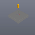

These models are intended to test combinations of collider shape types.

Each file contains a pair of objects; one static geometry and one dynamic rigid body, enumerating every combination of collision geometry type pair.

The dynamic rigid body is expected to remain above the XZ plane, supported by a collision with the static geometry.

Note, the sample images display a representation of the physics system and do not necessarily reflect the materials contained in the model.

 

| Property | **Values** |
| :---: | :---: |

 

The following table shows the properties that are set for a given model.

|   | Sample Image | Shape Type A | Shape Type B |
| :---: | :---: | :---: | :---: |
| [00](RigidBodies_ColliderTypeMatrix_00.gltf) |  | Sphere | Sphere |
| [01](RigidBodies_ColliderTypeMatrix_01.gltf) |  | Sphere | Box |
| [02](RigidBodies_ColliderTypeMatrix_02.gltf) |  | Sphere | Capsule |
| [03](RigidBodies_ColliderTypeMatrix_03.gltf) |  | Sphere | Cylinder |
| [04](RigidBodies_ColliderTypeMatrix_04.gltf) |  | Sphere | Convex hull |
| [05](RigidBodies_ColliderTypeMatrix_05.gltf) |  | Sphere | Triangle mesh |
| [06](RigidBodies_ColliderTypeMatrix_06.gltf) |  | Box | Sphere |
| [07](RigidBodies_ColliderTypeMatrix_07.gltf) |  | Box | Box |
| [08](RigidBodies_ColliderTypeMatrix_08.gltf) |  | Box | Capsule |
| [09](RigidBodies_ColliderTypeMatrix_09.gltf) |  | Box | Cylinder |
| [10](RigidBodies_ColliderTypeMatrix_10.gltf) |  | Box | Convex hull |
| [11](RigidBodies_ColliderTypeMatrix_11.gltf) |  | Box | Triangle mesh |
| [12](RigidBodies_ColliderTypeMatrix_12.gltf) |  | Capsule | Sphere |
| [13](RigidBodies_ColliderTypeMatrix_13.gltf) |  | Capsule | Box |
| [14](RigidBodies_ColliderTypeMatrix_14.gltf) |  | Capsule | Capsule |
| [15](RigidBodies_ColliderTypeMatrix_15.gltf) |  | Capsule | Cylinder |
| [16](RigidBodies_ColliderTypeMatrix_16.gltf) |  | Capsule | Convex hull |
| [17](RigidBodies_ColliderTypeMatrix_17.gltf) |  | Capsule | Triangle mesh |
| [18](RigidBodies_ColliderTypeMatrix_18.gltf) |  | Cylinder | Sphere |
| [19](RigidBodies_ColliderTypeMatrix_19.gltf) |  | Cylinder | Box |
| [20](RigidBodies_ColliderTypeMatrix_20.gltf) |  | Cylinder | Capsule |
| [21](RigidBodies_ColliderTypeMatrix_21.gltf) |  | Cylinder | Cylinder |
| [22](RigidBodies_ColliderTypeMatrix_22.gltf) |  | Cylinder | Convex hull |
| [23](RigidBodies_ColliderTypeMatrix_23.gltf) |  | Cylinder | Triangle mesh |
| [24](RigidBodies_ColliderTypeMatrix_24.gltf) |  | Convex hull | Sphere |
| [25](RigidBodies_ColliderTypeMatrix_25.gltf) |  | Convex hull | Box |
| [26](RigidBodies_ColliderTypeMatrix_26.gltf) |  | Convex hull | Capsule |
| [27](RigidBodies_ColliderTypeMatrix_27.gltf) |  | Convex hull | Cylinder |
| [28](RigidBodies_ColliderTypeMatrix_28.gltf) |  | Convex hull | Convex hull |
| [29](RigidBodies_ColliderTypeMatrix_29.gltf) |  | Convex hull | Triangle mesh |
| [30](RigidBodies_ColliderTypeMatrix_30.gltf) |  | Triangle mesh | Sphere |
| [31](RigidBodies_ColliderTypeMatrix_31.gltf) |  | Triangle mesh | Box |
| [32](RigidBodies_ColliderTypeMatrix_32.gltf) |  | Triangle mesh | Capsule |
| [33](RigidBodies_ColliderTypeMatrix_33.gltf) |  | Triangle mesh | Cylinder |
| [34](RigidBodies_ColliderTypeMatrix_34.gltf) |  | Triangle mesh | Convex hull |
| [35](RigidBodies_ColliderTypeMatrix_35.gltf) |  | Triangle mesh | Triangle mesh |
 
