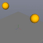
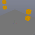

These models are intended to test combinations of physics collision filters.

Each scene contains a single static geometry and a pair of dynamic bodies, differing only in their initial position and collision filter. In each initial configuration, one body should not penetrate the static geometry, while the other penetrate the static geometry - either passing through it entirely in the basic case, or partially penetrating in the case of compound.

Note, the sample images display a representation of the physics system and do not necessarily reflect the materials contained in the model.

 

| Property | **Values** |
| :---: | :---: |

 

The following table shows the properties that are set for a given model.

|   | Sample Image | Description |
| :---: | :---: | :---: |
| [00](RigidBodies_CollisionFilter_00.gltf) |  | Validating  CollideWithSystems, single collider case |
| [01](RigidBodies_CollisionFilter_01.gltf) |  | Validating NotCollideWithSystems, single collider case |
| [02](RigidBodies_CollisionFilter_02.gltf) |  | Validating  CollideWithSystems, multiple collider case |
| [03](RigidBodies_CollisionFilter_03.gltf) |  | Validating NotCollideWithSystems, multiple collider case |
 
