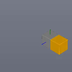

These models are intended to test combinations of collider shape types.

Each file contains a pair of objects; one static geometry and one dynamic rigid body, enumerating every combination of collision geometry type pair.

The dynamic rigid body is expected to remain above the XZ plane, supported by a collision with the static geometry.

Note, the sample images display a representation of the physics system and do not necessarily reflect the materials contained in the model.

 

| Property | **Values** |
| :---: | :---: |

 

The following table shows the properties that are set for a given model.

|   | Sample Image | Description |
| :---: | :---: | :---: |
| [00](RigidBodies_Joint_00.gltf) |  | Fixed joint |
| [01](RigidBodies_Joint_01.gltf) |  | Ball and socket joint |
| [02](RigidBodies_Joint_02.gltf) |  | Hinge joint with free rotation axis = 0 |
| [03](RigidBodies_Joint_03.gltf) |  | Hinge joint with free rotation axis = 1 |
| [04](RigidBodies_Joint_04.gltf) |  | Hinge joint with free rotation axis = 2 |
| [05](RigidBodies_Joint_05.gltf) |  | Prismatic joint |
| [06](RigidBodies_Joint_06.gltf) |  | Prismatic joint, collision enabled |
| [07](RigidBodies_Joint_07.gltf) |  | Stiff spring joint |
| [08](RigidBodies_Joint_08.gltf) |  | Revolute joint with offset center of mass |
| [09](RigidBodies_Joint_09.gltf) |  | Revolute joint with angular drive |
| [10](RigidBodies_Joint_10.gltf) |  | Prismatic joint, with linear drive |
 
