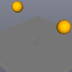
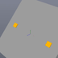

These models are intended to test combinations of physics material properties.

Each model contains one static geometry and two dynamic bodies which differ only in their initial position and physics material used. This allows for testing the material properties have some effect.

Note, the sample images display a representation of the physics system and do not necessarily reflect the materials contained in the model.
 

| Property | **Values** |
| :---: | :---: |

 

The following table shows the properties that are set for a given model.

|   | Sample Image | Description |
| :---: | :---: | :---: |
| [00](RigidBodies_Materials_00.gltf) |  | Compare behaviour of high and low restitution materials |
| [01](RigidBodies_Materials_01.gltf) |  | Validate physics material combine mode |
| [02](RigidBodies_Materials_02.gltf) |  | Compare behavior of high and low friction materials |
 
